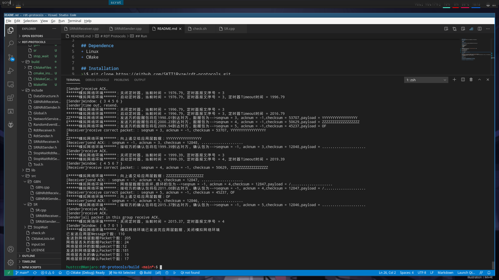

# RDT Protocols
HUST Computer Network Lab 2: Implemation of rdt-protocols.  
  

## Dependence
+ Linux
+ CMake

## Installation
>\$ git clone https://github.com/SKTT1Ryze/rdt-protocols.git  

## Build
>\$ cd rdt-protocols  
>\$ mkdir build  
>\$ cd build  
>\$ cmake ..  
>\$ make  

## Run
(Assuming that you are in the `rdt-protocols/build/` path)  
Run Stop-Wait rdt-protocol:  
>\$ ../bin/stop_wait  

Run GBN rdt-protocol:  
>\$ ../bin/gbn  

Run SR rdt-protocol:(not done)  
>\$ ../bin/sr  

## Check  
The executable file can write result in a file, you can specify it.  
the `check.sh` will check the content between `input.txt` and the result(written in a file), if the check pass, you pass the lab.  
Just modify the path int `check.sh` and run it:  
>\$ ./check.sh  

## TODO
SR Rdt Protocol  

## Create your own implementation of rdt-protocol  
Just read the source code and modify it. It's easy.  

## **Welcome to communicate and contribute!**  
